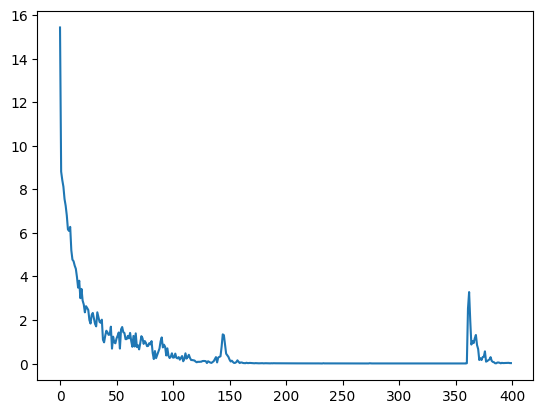

# Char-seq2seq

### Sample Dataset
```text
dataset = [
    ["Hello", "Hi"],
    ["I", "My"],
    ["I am", "I m"],
    ["Thankyou", "Thankyou!"],
    ["test code", "Test code"],
    ["It's work", "It is work"],
    ["He is", "He s"],
    ["he is", "he s"],
    ["He s", "He's"],
    ["he is", "he's"],
    ["you re", "you're"],
    ["She is", "She s"],
    ["she is", "she s"],
    ["She s", "She's"],
    ["she s", "she's"],
    ["You re", "You're"],
    ["I m", "I'm"],
    ["hello", "hi"],
    ["you are", "you re"],
    ["You are", "You re"],
    ["laugh of loud", "lol"],
    ["How are you", "H r u"],
    ["how are you", "h r u"],
    ["we are", "we re"],
    ["they are", "they re"],
    ["They are", "They re"],
    ["He's", "He is"],
    ["That is right", "That's right"],
    ["I am fine", "I m fine"],
    ["안녕하세요", "안녕"],
    ["반갑습니다", "반가워"],
    ["반가워요", "반가워"],
    ["안녕하십니까?", "안녕?"],
    ["안녕하세요?", "안녕?"],
    ["아버지가방에들어가신다", "아버지가 방에 들어가신다"],
    ["아기다리고기다리던여름방학", "아 기다리고 기다리던 여름방학"],
    ["인간", "사람"],
    ["ezreal", "is real"],
    ["lol", "laugh of loud"],
    ["hi", "hello"],
    ["h r u", "how are you"],
    ["H r u", "How are you"],
    ["LOL", "Laugh Of Loud"],
    ["What's your name?", "What is your name?"],
    ["what's your name?", "what is your name?"],
    ["What is your name?", "What's your name?"],
    ["what is your name?", "what's your name?"],
    ["How are you?", "H r u?"],
    ["Where is your cell phone?", "Where's your cell phone?"],
    ["where is your cell phone?", "where's your cell phone?"],
    ["That's right!", "That is right!"],
    ["that's right!", "that is right"],
    ["안녕하세요? 반갑습니다", "안녕? 반가워"],
]
```


### Train Losses

400 epochs

### Test
```text
input =  안녕하세요
output =  안녕<EOS>
```
```text
input =  테스트
output =  䥌⁡ふi걩 †くf가l<EOS>
```
```text
input =  반가워
output =  반가였<EOS>
```
```text
input =  한국어
output =  桉††楩ai<EOS>
```
```text
input =  영어
output =  ᡉ 0 뱧s y뤀뱵<EOS>
```
```text
input =  3000
output =  D 0ä¬à 0ä¬X ì„)Y<EOS>
```
```text
input =  이번 시험 혹시 범위가 어떻게 되는지 아세요? 제가 지난주 수업을 못가서요.
output =  암녨at밠견였 됡씀<EOS>
```
```text
input =  hi
output =  hello<EOS>
```
```text
input =  She is
output =  She s<EOS>
```
```text
input =  She is my friend
output =  lhl<EOS>
```
```text
input =  What's your name?
output =  What is your name?<EOS>
```
